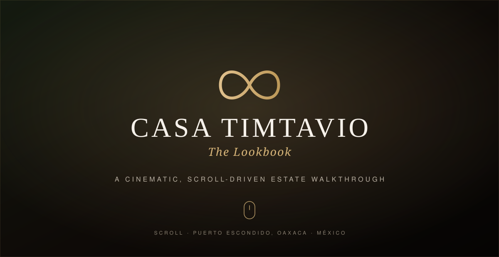

<div align="center">



# Casa TimTavio

**A private-estate teaser site for Casa TimTavio — Puerto Escondido, Oaxaca · México.**

An editorial marketing homepage paired with **`/lookbook`**, a cinematic, scroll-driven
walkthrough of the estate.

Built with Next.js 16 (App Router) · React 19 · TypeScript · Tailwind CSS v4 · Motion

</div>

---

## ✨ Overview

This repo hosts two experiences that live side by side under a single Next.js app, each
in its own isolated **route group** so they never share styling or chrome:

| Route | What it is |
| --- | --- |
| **`/`** | The marketing site — an editorial one-pager: hero, the estate, founder's quote, food & experience pillars, the membership circle, an invitation-request form, and the philosophy close. |
| **`/lookbook`** | The Lookbook — a full-screen, scroll-driven cinematic walkthrough of the estate (see below). |

---

## 🎬 The Lookbook

`/lookbook` is the centerpiece. It's a **sticky-deck, scroll-choreographed walkthrough** —
28 chapters / 50+ panels that ease past the viewer as they scroll, arranged as a cinematic
day-to-night arc: _Arrival → The Estate → Interiors → The Residences → The Evening → The
Location → Executive._

Key moments:

- **Tap-to-enter gate** — a gate-split reveal that doubles as the gesture to unlock ambient audio.
- **Smooth inertia scroll** ([Lenis](https://github.com/darkroomengineering/lenis)) driving a pinned, page-covering deck.
- **Signature pivot-door** panel scrubbed by scroll progress.
- **Ambient soundtrack** with a fade-in/mute toggle.
- **Progress rail**, chapter cues, and a single subtle reveal-on-enter.
- **Cloudinary-hosted imagery**, optimized on delivery (AVIF/WebP, right-sized, retina-aware).
- Design-detail panels (24-hour culinary program, amenities, a **bed-configuration / floor plan**, production footprint, and more).

The deck is fully **responsive** — the desktop pinned-scrub layout unfolds into a natural
vertical stack on mobile — and honors `prefers-reduced-motion`.

> It began life as a standalone Vite + React app and was migrated into this Next.js codebase
> as an isolated route, preserving the original layout, animations, and imagery verbatim.

### 📹 Add a screen recording

The poster above is a placeholder. A short screen recording shows the deck off far better —
to add one:

1. Run the app (`yarn dev`) and record `http://localhost:3000/lookbook` (macOS: <kbd>⇧⌘5</kbd>, or [Kap](https://getkap.co/)).
2. Export a **GIF** (or MP4) and save it as `docs/lookbook.gif`.
3. Swap the `src` at the top of this README to `docs/lookbook.gif`.

_(GitHub also lets you drag-and-drop an `.mp4` straight into the README editor and hosts it for you.)_

---

## 🧱 Tech stack

- **Framework** — [Next.js 16](https://nextjs.org) (App Router, Turbopack), **React 19**, **TypeScript**
- **Styling** — [Tailwind CSS v4](https://tailwindcss.com), plus scoped design tokens + plain CSS for the lookbook deck
- **UI** — [shadcn/ui](https://ui.shadcn.com) + [Radix](https://www.radix-ui.com), [Motion](https://motion.dev) (animation), [lucide-react](https://lucide.dev) (icons)
- **Forms** — [React Hook Form](https://react-hook-form.com) + [Zod](https://zod.dev) validation
- **Lookbook** — [Lenis](https://github.com/darkroomengineering/lenis) smooth scroll, [Cloudinary](https://cloudinary.com) media delivery
- **Email** — [Resend](https://resend.com) for invitation notifications
- **Images** — [Sharp](https://sharp.pixelplumbing.com) build-time optimization (`next/image` + a prebuild pass)

---

## 📂 Project structure

```
src/
├─ app/
│  ├─ (site)/                 # root layout + homepage (marketing site)
│  │  ├─ layout.tsx
│  │  └─ page.tsx
│  ├─ (lookbook)/             # SEPARATE root layout — isolated from the site
│  │  ├─ layout.tsx           #   own <html>/<body>, own CSS, no shared chrome
│  │  └─ lookbook/page.tsx    #   → /lookbook
│  ├─ api/notify-invitation/  # invitation-form email endpoint
│  └─ globals.css
└─ components/
   ├─ hero-section/ · the-estate-section/ · food-pillar/ · experience-pillar/
   │  the-circle/ · exclusive-member-form-section/ · philosophy-section/ · …   # homepage
   ├─ layout/                 # header, footer, section-dot indicator
   ├─ ui/                     # shadcn primitives
   └─ lookbook/               # the migrated cinematic deck
      ├─ App.jsx              #   deck root (client)
      ├─ components/          #   DeckSlide, DeckPanel, Nav, ProgressRail, EnterGate, AmbientAudio, …
      ├─ hooks/ · lib/        #   scroll choreography, media preload, Cloudinary helpers
      ├─ data/slides.js       #   the chapter/panel content
      └─ styles/              #   design tokens + deck CSS
```

Two isolated root layouts are what let the lookbook ship its own bare-element CSS and design
tokens without ever colliding with the site's Tailwind globals, header, or footer.

---

## 🚀 Getting started

```bash
# 1. install
yarn install

# 2. configure environment (see below)
cp .env.example .env.local   # then fill in values

# 3. run
yarn dev
```

Open **http://localhost:3000** for the site and **http://localhost:3000/lookbook** for the deck.

### Environment variables

Create `.env.local` (git-ignored). None of these are committed.

| Variable | Used by | Required for |
| --- | --- | --- |
| `NEXT_PUBLIC_CLOUDINARY_CLOUD_NAME` | Lookbook media helpers (browser-safe) | `/lookbook` imagery |
| `RESEND_API_KEY` | `/api/notify-invitation` | Sending invitation emails |
| `MONOREPO_API_URL` | `/api/notify-invitation` | Forwarding inquiries to the estate dashboard |

> The `/lookbook` deck renders fine without the Resend / dashboard vars — those only power the
> invitation form on the homepage.

---

## 📜 Scripts

| Command | Description |
| --- | --- |
| `yarn dev` | Start the dev server (Turbopack) |
| `yarn build` | Optimize images (prebuild) then build for production |
| `yarn start` | Serve the production build |
| `yarn lint` | Run ESLint |
| `yarn optimize-images` | Run the image-optimization pass on its own |

---

## ☁️ Deployment

Deployed on **[Vercel](https://vercel.com)**. Production ships from the default branch; every
other branch gets its own isolated **Preview** deployment — handy for sharing work-in-progress
(e.g. the lookbook) with stakeholders without touching production.

---

<div align="center">
<sub>© Casa TimTavio · Puerto Escondido, Oaxaca · México</sub>
</div>
